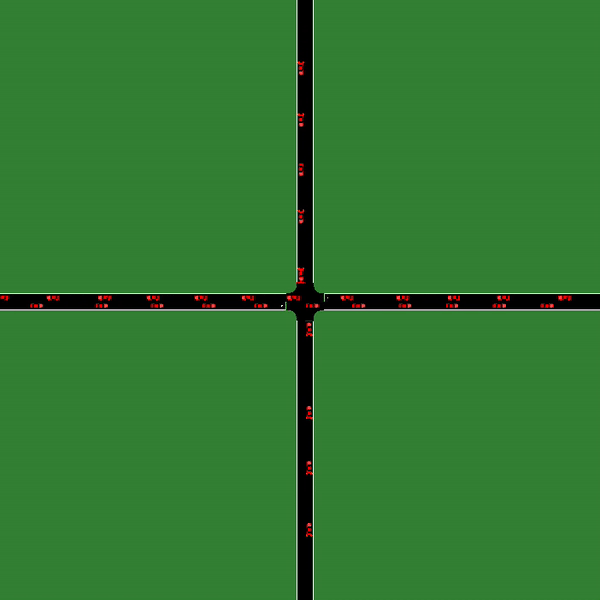

## Reinforcement Learning for Eco-Lagrangian Control at Intersections
#### Vindula Jayawardana (MIT) and Cathy Wu (MIT)

Signalized intersections in arterial roads result in persistent vehicle idling, accelerations and decelerations thereby contributing significantly towards fuel consumption and CO2 emission levels. There has thus been a line of work studying eco-driving control strategies to reduce fuel consumption and emission levels at intersections. However, methods to devise effective control strategies across a variety of traffic settings remains elusive. In this paper, we propose a reinforcement learning (RL) approach to learn effective eco-driving control strategies. In contrast to existing strategies, an RL approach 1) does not require the vehicle dynamics to take on a specific mathematical form (i.e., model-free), 2) accounts for the complexity of inter-vehicle traffic dynamics, and 3) accommodates rich objectives of reducing fuel consumption while minimizing the impact on travel time. We analyze the potential impact of the learned control policy on fuel consumption, CO2 emission, and travel time, in comparison to human-like driving and model-based baselines. We further demonstrate the generalizability of the learned policies under mixed traffic scenarios. Simulation results indicate that scenarios with 100% CAVs may yield as high as 18% reduction in fuel consumption, 25% reduction in CO2 emission levels while even improving the average travel speed by 20%.

### Results

    
|        Model                 |    Fuel(L)   | Emission(kg)  | Avg. speed(m/s)  |   
|------------|----------------|----------------|--------------------| 
| Gain (vs V-IDM)              | 17.76%       | 25.38% | 19.95% |   
| Gain (vs N-IDM)              | 18.39%        | 27.43% | 20.56% |   
| Gain (vs M-IDM)              | 25.53%         | 33.38% | 31.94% |   
| Gain (vs Eco-CACC)           | 4.70%         | 2.98%  | -1.04% |   


<p align="center">
    
</p>

### Installation
1. Make sure that your computer's or server's OS is Ubuntu 18.04 or lower, or Mac.
2. Follow instructions [here](https://docs.conda.io/projects/conda/en/latest/user-guide/install/) to install Miniconda, likely `wget https://repo.anaconda.com/miniconda/Miniconda3-latest-Linux-x86_64.sh` followed by `bash Miniconda3-latest-Linux-x86_64.sh`
3. Run `bash scripts/setup_sumo_<os_version>.sh` corresponding to your OS version to set up SUMO and add `~/sumo_binaries/bin` to your `PATH` environment variable. Try running `sumo`
4. Install PyTorch from [pytorch.org](pytorch.org).
5. Install dependencies `pip install -r requirements.txt`

### Run Instructions
`<agent_type>` is the type of the agents that can be used to control CAVs. Available options: RL, IDM

`<res_dir>` is the result directory, which is where the model checkpoints, training logs, and training csv results will be saved. Add `render` as an argument for using `sumo-gui` instead of `sumo`. E.g. `python pexps/<script>.py <res_dir> render`.

#### Eco-driving in 1x1 intersection
`python pexps/main.py --agent <agent_type> --res <res_dir>`


### Citation

```
@inproceedings{jayawardana2021,
        title={Reinforcement Learning for Eco-Lagrangian Control at Intersections},
        author={Vindula Jayawardana and Cathy Wu},
        booktitle={20th European Control Conference (ECC)},
        year={2022},
    }
```
### Acknowledgement

This research was supported by MIT-IBM Watson AI Lab. The authors acknowledge the MIT SuperCloud and Lincoln Laboratory Supercomputing Center for providing computational resources that have contributed to the research results reported within this paper. The authors would like to thank Mark Taylor, Blaine Leonard, Matt Luker and Michael Sheffield at the Utah Department of Transportation for numerous constructive discussions. The authors would also like to thank Zhongxia Yan for his help in coding the original framework that was extended to produce the computational results reported in this paper.
