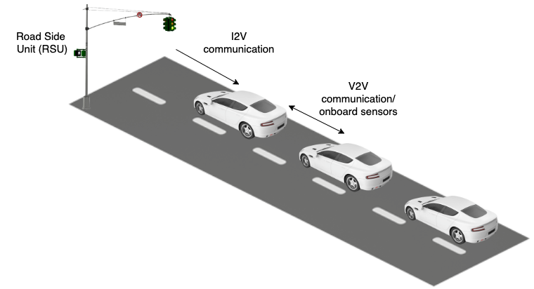
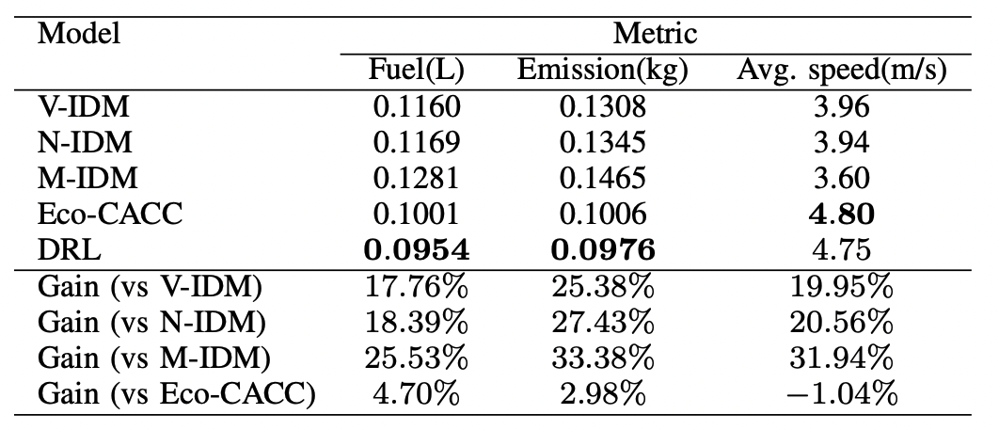
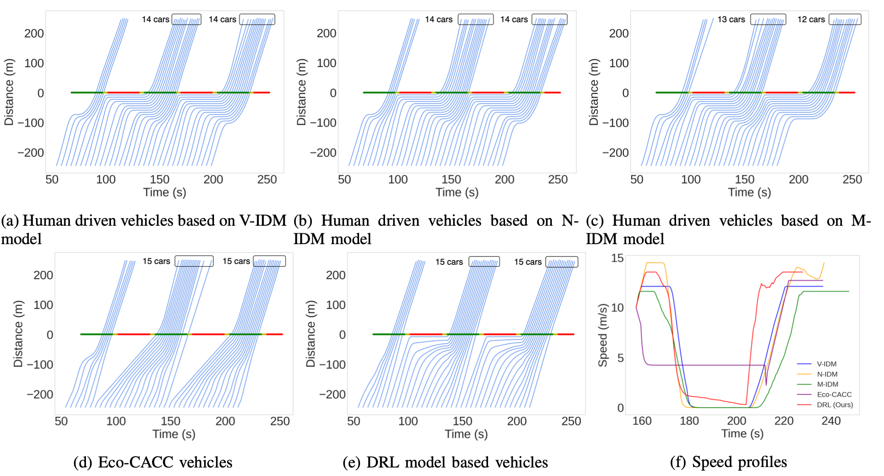
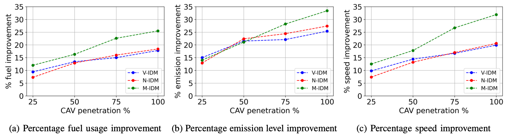

@import "{{ site.theme }}";
.markdown-body {
  font-family: "Open Sans", "Helvetica Neue", Helvetica, Arial, sans-serif;
}
@import "{{ site.theme }}";
.markdown-body {
  line-height: 1.1;
}
@import "{{ site.theme }}";
.markdown-body {
  font-size: 12px;
}

<p align="center">
    
</p>

Signalized intersections in arterial roads result in persistent vehicle idling and excess accelerations, contributing to fuel consumption and CO2 emissions. There has thus been a line of work studying eco-driving control strategies to reduce fuel consumption and emission levels at intersections. However, methods to devise effective control strategies across a variety of traffic settings remain elusive. In this paper, we propose a reinforcement learning approach to learn effective eco-driving control strategies. We analyze the potential impact of a learned strategy on fuel consumption, CO2 emission, and travel time and compare with naturalistic driving and model-based baselines. We further demonstrate the generalizability of the learned policies under mixed traffic scenarios. Simulation results indicate that scenarios with 100% penetration of connected autonomous vehicles (CAV) may yield as high as 18% reduction in fuel consumption and 25% reduction in CO2 emission levels while even improving travel speed by 20%. Furthermore, results indicate that even 25% CAV penetration can bring at least 50% of the total fuel and emission reduction benefits.

### Results

<p align="center">
    
    
</p>

<p align="center">
    Human behavior (100% human driver penetration)
    &nbsp;&nbsp;&nbsp;&nbsp;
    Learned behavior (100% CAV penetration)
</p>

#### Baselines

* V-IDM: The deterministic vanilla version of the IDM car-following model. It is a driving baseline that can produce realistic shock waves.
* N-IDM: Adds a noise sampled from a uniform distribution unif (−0.2, 0.2) to the IDM defined acceleration a. This is a driving baseline that can produce realistic shock waves and models variability in driving behaviors of humans.
* M-IDM: Developed on top of N-IDM model such that IDM parameters for each driver are sampled from respective Gaussian distributions. It represents a more diverse mix of drivers with varying levels of aggressiveness.
* Eco-CACC: A model-based trajectory optimization strategy.

#### Q1 How does the proposed control policy compare to naturalistic driving and model-based control baselines?
<p align="center">
    
</p>
Comparison of per vehicle fuel consumption (lower is better), emission level (lower is better) and average speed (higher is better) under different control strategies with 100% CAV penetration rate


<p align="center">
    
</p>
Time space diagrams of north-bound vehicle trajectories produced by a) V-IDM model, b) N-IDM model, c) M-IDM model, d) Eco-CACC model, and e) DRL model. Both Eco-CACC and DRL models demonstrate behaviors which involve reduced stopping at the intersection as compared to IDM variants. Both Eco-CACC and DRL models increase the throughput of vehicles during a green light phase by one extra vehicle as can be seen in Figure d and e. Figure f shows the speed profile of a selected vehicle under the five different control strategies.

#### Q2 How well does the proposed control policy generalize to environments unseen at training time?

<p align="center">
    
</p>

Percentage improvement in terms of fuel usage, emission levels and average speed from the IDM variant baselines under different CAV penetration rates (CAVs are controlled by zero-shot transferred DRL policy).

### Citation

```
@inproceedings{jayawardana2022learning, 
               author={Jayawardana, Vindula and Wu, Cathy}, 
               booktitle={2022 European Control Conference (ECC)}, 
               title={Learning Eco-Driving Strategies at Signalized Intersections} 
               year={2022}, pages={383-390}, doi={10.23919/ECC55457.2022.9838000}}
```

### Authors 

<div style="text-align: left;">

<div class="person">
  <br>
  <a href="{{ person.url | relative_url }}">{{ person.name }}</a><br>
  <span>{{ person.title | replace: '&', '<br>' }}</span>
</div>


</div>

### Acknowledgement

This work was supported by the MIT-IBM Watson AI Lab. The authors acknowledge the MIT SuperCloud and Lincoln Laboratory Supercomputing Center for providing computational resources that have contributed to the research results reported within this paper. The authors are grateful to Mark Taylor, Blaine Leonard, Matt Luker and Michael Sheffield at the Utah Department of Transportation for numerous constructive discussions. The authors would also like to thank Zhongxia Yan for his help in developing the original framework that was extended to produce the computational results reported in this paper.
<br><br>


<p style="text-align:right;font-size:small;">
    Website Design <a href="https://github.com/pages-themes/cayman"><span>&#9734;</span></a> and <a href="https://github.com/agarwl/rliable"><span>&#9734;</span></a>
</p>